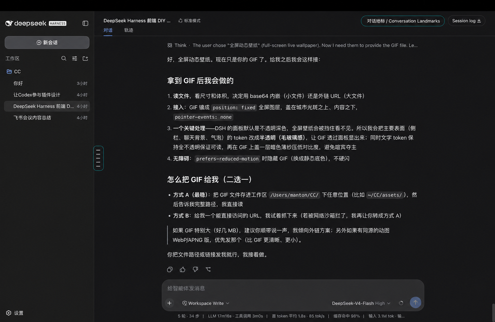
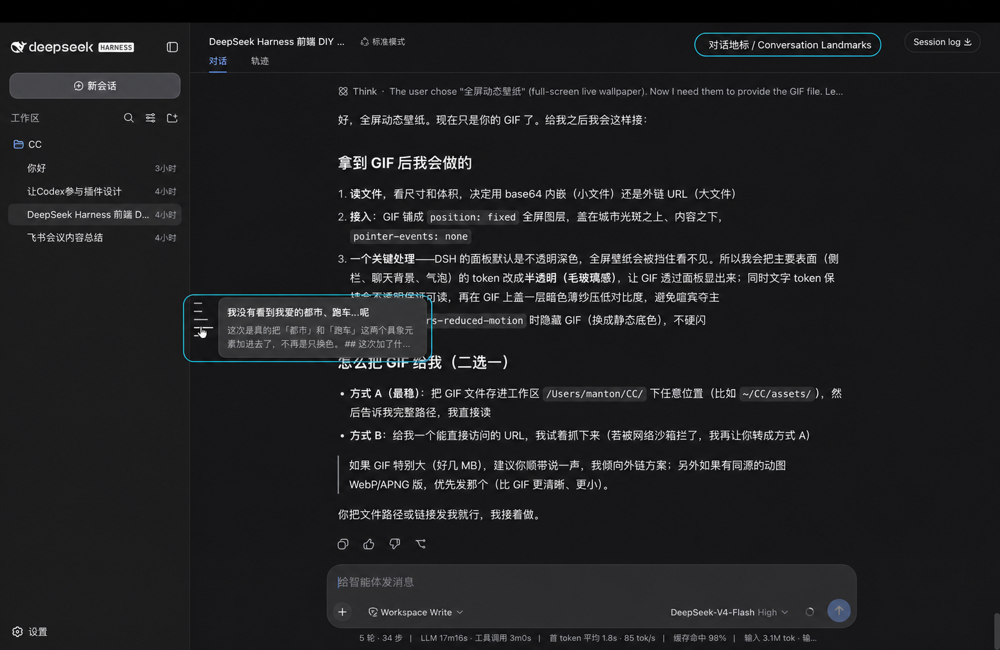

# Conversation Landmarks for DeepSeek Harness

English | [简体中文](README.zh.md)

Conversation Landmarks is an independent [DeepSeek Harness](https://github.com/deepseek-ai/deepseek-harness) Web plugin for navigating long conversations. It adds a fixed, vertically centered landmark rail to the left edge of the conversation workspace. Each line represents one direct user task rather than every individual message.



## What it does

- Keeps the complete landmark rail fixed and vertically centered while the conversation scrolls.
- Selects the line nearest the pointer. The selected line becomes longest and pure white; its two neighbors expand to a middle length.
- Shows a compact preview of the user request and the latest following Assistant answer.
- Loads older history when necessary, then aligns the selected user message with the top of the conversation viewport.
- Uses the official session projection and Client slot extension points. It does not patch DeepSeek Harness source files.
- Performs no plugin-owned network requests and collects no telemetry.



## Install

Requirements: DeepSeek Harness `0.1.0-rc.7` or later and its supported Node.js version.

Install the prebuilt plugin into the Web profile, then restart Web:

```sh
dsh plugin --profile web add "github:mantonlove/dsh-conversation-landmarks#v0.1.0"
dsh web
```

The repository commits the required `lib/` artifacts, so this GitHub install does not ask pnpm to run a package build script.

Open the actual URL printed after `dsh web:` in the startup output. The default is `http://127.0.0.1:3080`, but the address can differ when the port or host is configured.

If you run DeepSeek Harness from its source checkout, use the same commands with `pnpm dsh`:

```sh
pnpm dsh plugin --profile web add "github:mantonlove/dsh-conversation-landmarks#v0.1.0"
pnpm dsh web
```

Remove the plugin with:

```sh
dsh plugin --profile web remove dsh-conversation-landmarks
```

## Prompt for an AI coding agent

You can paste this into an agent that has terminal access to your DeepSeek Harness installation:

> Install `github:mantonlove/dsh-conversation-landmarks#v0.1.0` into the DeepSeek Harness `web` profile with `dsh plugin`, restart `dsh web`, and tell me the actual URL printed after `dsh web:`. Do not edit DeepSeek Harness source files.

## Develop

```sh
pnpm install
pnpm run check
```

The package is a Cordis Service plugin. Its Host half registers the `conversationLandmarks` session projection through `ctx.effect()`. Its browser half mounts through `conversation.input.dock`, then renders the fixed rail in a portal.

## Status

This is a community project, not an official DeepSeek release. The current compatibility target is DeepSeek Harness `0.1.0-rc.7`.

## License

[MIT](LICENSE)
